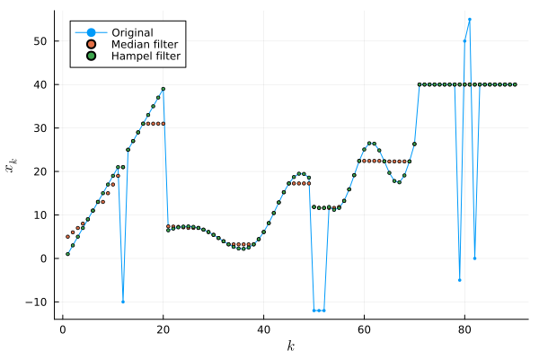

# HampelOutliers.jl

This package provides a basic Julia implementation of the Hampel filter[^1], which is a robust method for detecting and replacing outliers in a univariate time series. Compared to convolutional filters, the Hampel filter is less likely to smooth edges and better at removing isolated spikes without affecting the rest of the data. But it is tunably less aggressive than a standard median filter.

[^1]: J Astola, P Kuosmanen, Fundamentals of nonlinear digital filtering (CRC Press, Boca Raton, FL, USA, 1997)



Given the values $x_1, x_2,\dots,$ the Hampel filter replaces elements $x_k$ such that

$$|x_k - m| > t S,$$

where $m$ is the median of the elements, $t$ is a positive parameter (often set to 2 or 3), and $S$ is a measure of dispersion. Typically, flagged elements are replaced by the median of the non-flagged elements.

By default, the spread $S$ is the median absolute deviation (MAD) of the data, normalized by about 1.48 so that it becomes an unbiased estimator of the standard deviation for normally distributed values.

For $t=0$, the Hampel filter is equivalent to the median filter. As $t$ increases, the Hampel filter becomes more tolerant of outliers. For example:

```julia-repl
julia> using HampelOutliers, Statistics, StatsBase
julia> x = collect(1:11); x[5] = -6;
julia> m, S = median(x), mad(x, normalize=true)
(6.0, 4.447806655516805)
```

At the default threshold, $t=2$, the Hampel filter flags the outlier at index 5:

```julia-repl
julia> findall( Hampel.identify(x) )
1-element Vector{Int64}:
 5
```

If we change the threshold to $t=3$, however, the outlier is accepted:

```julia-repl
julia> findall( Hampel.identify(x, threshold=3) )
Int64[]
```

## Windowing and weighting

In the context of a time series, the Hampel filter criterion and replacement is usually applied in a moving window fashion. For this package, the window length is always odd, and you specify the half-width. For example, 

```julia-repl
julia> x = @. cos((0:10) / 5);
julia> x[[5, 6]] .= [9, -3];
julia> findall( Hampel.filter(x, 1) .!= x )
Int64[]

julia> findall( Hampel.filter(x, 2) .!= x )
2-element Vector{Int64}:
 5
 6
```

One may also specify integer weights $w_1, w_2, \dots, w_{2K+1}$ that specify a number of repetitions of each value to be used within the window for median and spread calculations. For example, if the weights are $[1, 2, 3, 1, 1]$, then the original windowed values $[-1, -2, -3, -4, -5]$ are expanded to

$$
[-1, -2, -2, -3, -3, -3, -4, -5]
$$

before the median and spread are calculated.

## Recursive application

If replaced values are used immediately in the calculations for following values, the filter is called *recursive*. That is, if $x_1,\dots,x_{i-1}$ have been replaced by $y_1,\dots,y_{i-1}$, then the values used for determining $y_{i}$ in a window of width $2K+1$ are $y_{i-K},\dots,y_{i-1},x_{i},\dots,x_{i+K}$.

You can accomplish the recursive form by using the mutating `Hampel.filter!`, as shown here:

```julia-repl
julia> t = 0:40;
julia> x = @. sign(cos(3t)) + 0.1*sin(t/4);
julia> y = Hampel.filter(x, 4);  # nonrecursive
julia> count(x .!= y)
8

julia> Hampel.filter!(x, x, 4);  # recursive
julia> count(x .!= y)
17
```

## Boundary conditions

At the ends of the sequence, the window refers to fictitious values that are outside the sequence. The `boundary` keyword argument specifies how these situations are handled. The options are:

- `:truncate` (the default) means that the window is truncated at the ends of the sequence.
- `:repeat` means that the sequence is extended by repeating the first and last values.
- `:reflect` means that the sequence is extended by reflecting across the boundaries.
  